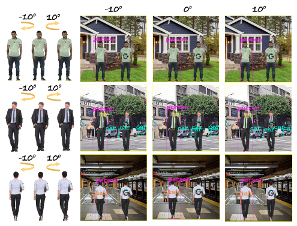
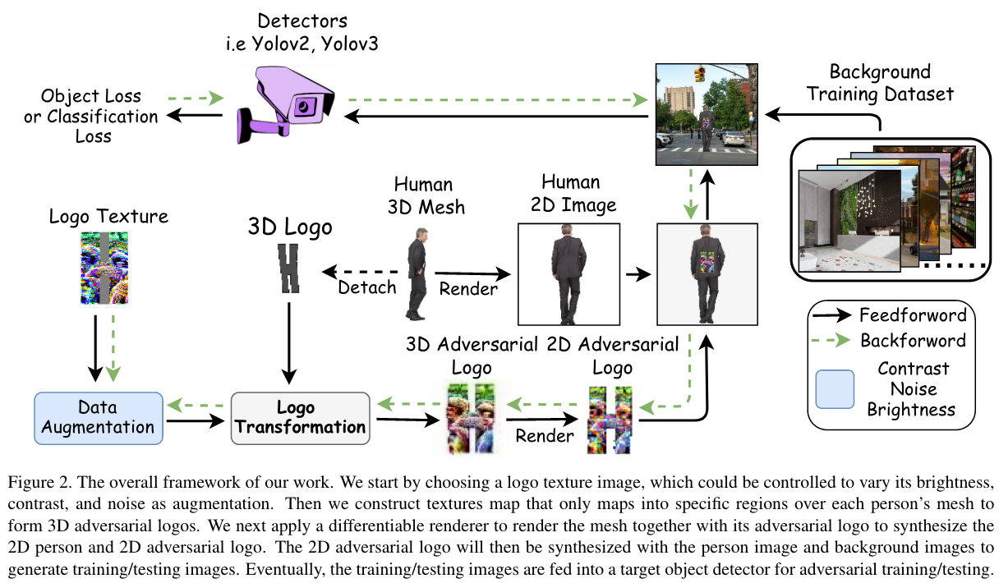

# Can 3D Adversarial Logos Clock Humans? #

[](https://opensource.org/licenses/MIT)

[Can 3D Adversarial Logos Clock Humans?]()

Tianlong Chen\*, Yi Wang\*, Jingyang Zhou*, Sijia Liu, Shiyu Chang, Chandrajit Bajaj, Zhangyang Wang


## Overview

Examples of our 3D adversarial logo attack on different3D object meshes to fool a YOLOV2 detector. 




## Methodology




## Prerequisites and Installation

- Python 3

- Pytorch 1.0.0

- CUDA 9.2 (lower versions may work but were not tested)

- TensorboardX 

  ```shell
  pip install tensorboardX tensorboard
  ```

- Neural renderer 

  ```shell
  pip install neural-renderer-pytorch
  ```

- Clone this repo 

  ```shell
  git clone https://github.com/TAMU-VITA/3D_Adversarial_Logo.git
  cd 3D_Adversarial_Logo
  ```

- Yolov2 weights

  ```shell
  mkdir weights
  curl https://pjreddie.com/media/files/yolov2.weights -o weights/yolo.weights
  ```

  

## Usage

### Prepare the dataset

- Datasets and our prediction images can be found [here](https://drive.google.com/file/d/1CUC_Yy10sjGSvSG8wt-ToPtOJ_eEf8x-/view?usp=sharing).
- Our pre-trained weights can be found [here](https://drive.google.com/file/d/1AeWOzhLUbf7XK4-bo-rtvcQ1VKO_bn30/view?usp=sharing).

Remark. After downloading them, put the data and weight under the `3D_Adversarial_Logo` folder.


### Arguments

- `--width` : the width of the universal logo.
- `--height` : the height of the universal logo.
- `--depth` : the depth of the universal logo (default is 1 to form an image).
- `--angle_range` : the angle range of the camera view for training (eg. 10 for +/- 10 degree)
- `--logonum` : the total faces of the 3D logo.
- `--train_mesh` : which mesh to train (the 123 denotes mesh 1&2&3, which can be further upgraded by adding `nargs='+'` in parsing args).
- `--test_mesh` : which mesh to test (the 123 denotes mesh 1&2&3, which can be further upgraded by adding `nargs='+'` in parsing args).
- `--consistent` : whether to share the same universal logo among all the meshes.
- `--logo_ref` : which logo to train with.
- `--train_patch` : whether to train 2D patch.
- `--restore_model` : whether to restore the saved universal logo.
- `--save_model` : whether to save the universal logo.


### Run 3D adversarial logos ###

- logo: X

  ```shell
  python train_patch1.py --width=100 --height=150 --depth=1 --angle_range=0 --logonum=25 --train_mesh=123 --consistent --logo_ref=X --save_model >logo-records/logoX.out 2>&1 &
  ```

- logo: X (medium) 

  ```shell
  python train_patch1.py --width=100 --height=150 --depth=1 --angle_range=0 --logonum=10 --train_mesh=123 --consistent --logo_ref=X --save_model >logo-records/logoX.out 2>&1 &
  ```

- logo: X (small) 

  ```shell
  python train_patch1.py --width=100 --height=150 --depth=1 --angle_range=0 --logonum=5 --train_mesh=123 --consistent --logo_ref=X --save_model >logo-records/logoX.out 2>&1 &
  ```

- logo: H

  ```shell
  python train_patch1.py --width=100 --height=150 --depth=1 --angle_range=0 --logonum=25 --train_mesh=123 --consistent --logo_ref=H --save_model >logo-records/logoH.out 2>&1 &
  ```

- logo: T

  ```shell
  python train_patch1.py --width=100 --height=150 --depth=1 --angle_range=0 --logonum=25 --train_mesh=123 --consistent --logo_ref=T --save_model >logo-records/logoT.out 2>&1 &
  ```

- logo: G

  ```shell
  python train_patch1.py --width=100 --height=100 --depth=1 --angle_range=0 --logonum=17 --train_mesh=123 --consistent --logo_ref=G --save_model >logo-records/logoG.out 2>&1 &
  ```

- logo: C 

  ```shell
  python train_patch1.py --width=100 --height=100 --depth=1 --angle_range=0 --logonum=17 --train_mesh=123 --consistent --logo_ref=C --save_model >logo-records/logoC.out 2>&1 &
  ```

- logo: O 

  ```shell
  python train_patch1.py --width=100 --height=100 --depth=1 --angle_range=0 --logonum=17 --train_mesh=123 --consistent --logo_ref=O --save_model >logo-records/logoO.out 2>&1 &
  ```

- logo: tw 

  ```shell
  python train_patch1.py --width=100 --height=100 --depth=1 --angle_range=0 --logonum=25 --train_mesh=123 --consistent --logo_ref=tw --save_model >logo-records/logotw.out 2>&1 &
  ```

- logo: drop 

  ```shell
  python train_patch1.py --width=100 --height=150 --depth=1 --angle_range=0 --logonum=25 --train_mesh=123 --consistent --logo_ref=drop --save_model >logo-records/logodrop.out 2>&1 &
  ```

  

### Train 2D adversarial patch
- logo: G 

  ```shell
  python train_patch1.py --width=100 --height=100 --depth=1 --angle_range=0 --logonum=17 --train_mesh=123 --consistent --logo_ref=G --restore_model --save_model --train_patch
  ```


## Citation

If you are use this code for you research, please cite our paper.

```
TBD
```

